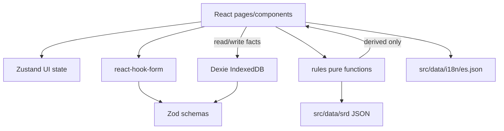
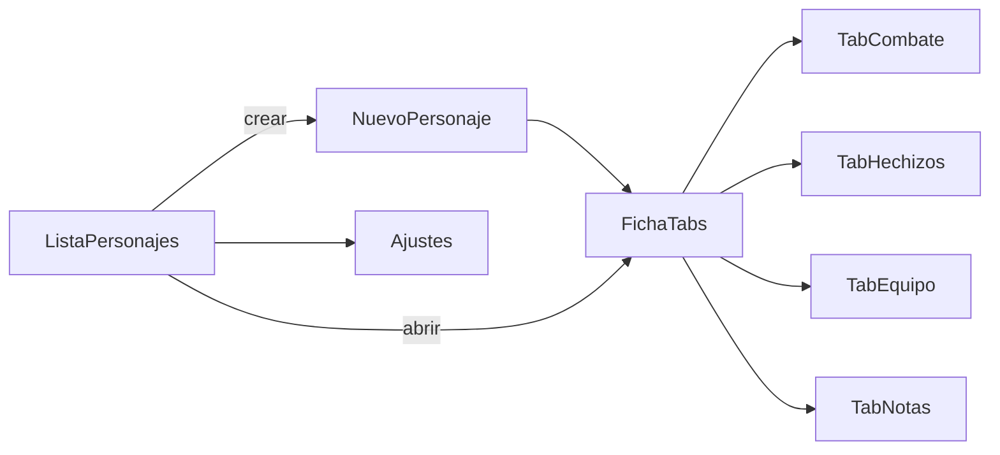

# SPEC — Ficha de personaje D&D 2024 (PWA)

Contrato del proyecto. Alcance congelado por **fase** (v1 / v2). Ante dudas no documentadas aquí: proponer en 3 líneas y esperar OK antes de codificar reglas D&D o nuevas librerías.

---

## Visión

PWA offline-first para gestionar fichas de personaje **D&D 5e reglas 2024 (SRD 5.2.1)**. Uso personal o grupos reducidos. Sin backend. Datos locales (IndexedDB). Optimizada para mesa real: acceso rápido, offline tras instalación, automatización de cálculos repetitivos sin sustituir decisiones del jugador.

Proyecto **independiente** de [herramientas-dm](https://github.com/dmastergestion/herramientas-dm). Reutilización opcional: export mínimo compatible con tracker, color crítico `#ffd54f`.

---

## Stack

| Capa | Tecnología |
|------|------------|
| Lenguaje | TypeScript |
| UI | React 18+, Tailwind CSS, shadcn/ui |
| Build | Vite |
| Estado UI | Zustand (pestaña activa, modales, última tirada) |
| Formularios | react-hook-form |
| Validación / tipos | Zod (forma de datos persistidos) |
| Persistencia | Dexie.js (IndexedDB, schema versionado) |
| PWA | vite-plugin-pwa |
| Tests | Vitest (`src/rules/` + migraciones Dexie) |
| Despliegue | GitHub Pages |
| Idioma UI | Español |
| PDF | v2 — `@react-pdf/renderer` |

**Roles de capas:** Zod valida *qué se guarda*; `rules/` calcula *derivados*; React solo renderiza y delega.

---

## Reglas de desarrollo

- No añadir funcionalidades fuera de la fase activa (ver tabla v1/v2).
- No inventar reglas D&D: solo SRD 2024 / reglas documentadas en esta SPEC.
- React **nunca** contiene lógica de reglas.
- Cálculos derivados **nunca** se persisten (modificadores, CA calculada, bonificador de competencia).
- Sin APIs externas en runtime.
- Sin librerías nuevas sin justificación explícita.
- Desviaciones menores de UX: proponer brevemente; mayores (reglas, deps): bloqueo hasta OK.

---

## Fuera de alcance (global)

Tracker de iniciativa de grupo, mapas, multijugador, vista DM/party, VTT, backend/nube, multi-idioma, reglas 2014, bestiario, campañas/sesiones, multiclass (v1), PDF (v1), efectos automatizados (v1).

---

## Alcance por fase

### v1 — Mesa jugable

| Incluir | Excluir (v2) |
|---------|----------------|
| Lista de personajes, crear / editar / duplicar / eliminar | Multiclass |
| Identidad: nombre, jugador, especie, clase, subclase, trasfondo, nivel 1–20 | PDF export |
| Una sola clase por personaje | Efectos/condiciones con reglas automáticas |
| 6 atributos + tiradas d20 (normal, ventaja, desventaja) | Peso/carga de inventario |
| Pericias y salvaciones (proficiencias SRD + override manual) | Integración automática suite DM |
| PV máx/actuales/temp, dados de golpe, CA (armadura SRD + escudo) | |
| Iniciativa, velocidad, inspiración heroica (checkbox) | |
| Catálogo SRD completo: 12 clases, subclases, hechizos, armaduras SRD | |
| Hechizos: slots por clase, trucos, preparados/conocidos (según clase SRD) | |
| Descanso corto/largo: PV, dados de golpe, slots de hechizo | |
| Condiciones: lista manual (texto/checkboxes, sin motor de reglas) | |
| Equipo: armadura + escudo SRD equipados; resto lista libre | |
| Export/import JSON backup + export mínimo tracker | |
| PWA instalable, offline | |
| Atribución CC BY 4.0 en Ajustes | |

### v2 — Posterior

PDF inspirado en ficha WoTC (no réplica), multiclass, efectos con reglas, inventario avanzado, mejoras PWA.

---

## Objetivos de mesa (v1)

- Abrir ficha guardada: **< 2 s**
- Tirada d20 con modificador: **≤ 1 clic** desde vista combate
- Aplicar daño/curación PV: **≤ 2 clics**

---

## Arquitectura

```text
ficha-personaje/
├── .github/workflows/     # CI: test, build, deploy Pages
├── public/
├── scripts/
│   ├── build-srd.ts       # Markdown EN → src/data/srd/*.json
│   └── build-i18n-es.ts   # Traducciones → src/data/i18n/es.json
├── data/i18n/
│   └── overrides.es.json  # Correcciones manuales ES
├── src/
│   ├── app/               # Router, providers, layout
│   ├── components/        # UI (shadcn + compuestos ficha)
│   ├── db/                # Dexie schema, migraciones, repositorio
│   ├── hooks/
│   ├── pages/             # Pantallas (ver flujos)
│   ├── rules/             # Motor puro (sin React)
│   │   ├── dice.ts
│   │   ├── ability.ts
│   │   ├── character.ts
│   │   ├── combat.ts
│   │   ├── spells.ts
│   │   ├── rests.ts       # v1: solo short/long rest helpers
│   │   └── srd/           # lookup sobre JSON estático
│   ├── schemas/           # Zod: personaje, export, SRD
│   ├── stores/            # Zustand
│   ├── data/
│   │   ├── srd/           # JSON generado (gitignored o committed post-build)
│   │   └── i18n/
│   ├── lib/               # utils, i18n t(), constants
│   └── test/
├── SPEC.md
├── PROMPT.md
└── README.md
```

### Flujo de datos



---

## Pipeline SRD

| Rol | Fuente |
|-----|--------|
| Legal | [SRD 5.2.1 PDF](https://media.dndbeyond.com/compendium-images/srd/5.2/SRD_CC_v5.2.pdf) — CC BY 4.0 |
| Parseo | [downfallx/dnd-5e-srd-markdown](https://github.com/downfallx/dnd-5e-srd-markdown) |
| QA | [sycarion/5e-2024-SRD](https://github.com/sycarion/5e-2024-SRD) |
| ES | Foundry `translate-dnd5e-sdr2-es` + glosario SRD 5.1 ES (Nosolorol) + `overrides.es.json` |

- IDs internos: `snake_case` en inglés (estables).
- Texto visible: siempre desde `i18n/es.json` keyed por id.
- Build-time only; **cero fetch** en la app.

---

## Modelo de datos (Dexie)

### Tabla `characters`

Documento validado con `CharacterSchema` (Zod). Versión de esquema: `schemaVersion: 1`.

```typescript
// Referencia — implementación en src/schemas/character.ts

CharacterSchema = {
  id: string (uuid),
  schemaVersion: 1,
  meta: {
    createdAt: ISO8601,
    updatedAt: ISO8601,
  },
  identity: {
    name: string,
    playerName: string,
    speciesId: string | null,      // id SRD
    classId: string,               // una sola clase v1
    subclassId: string | null,
    backgroundId: string | null,
    level: 1..20,
  },
  abilities: {
    str, dex, con, int, wis, cha: 1..30,
  },
  proficiencies: {
    savingThrows: AbilityKey[],    // override manual
    skills: SkillKey[],
    skillOverrides: Record<SkillKey, boolean>, // forzar prof/no prof
  },
  combat: {
    hpMax: number,
    hpCurrent: number,
    hpTemp: number,
    hitDiceTotal: number,
    hitDiceUsed: number,
    hitDie: string,                // ej. "d10" de clase SRD
    armorClassOverride: number | null,
    initiativeOverride: number | null,
    speedOverride: number | null,
    inspiration: boolean,
    conditions: string[],          // texto libre v1
  },
  equipment: {
    armorId: string | null,        // id SRD armadura
    shieldEquipped: boolean,
    items: { id: string, name: string, qty: number, notes?: string }[],
  },
  spells: {
    abilityKey: AbilityKey | null,
    cantripsKnown: string[],       // ids hechizo SRD
    spellsKnown: string[],
    spellsPrepared: string[],
    spellSlotsUsed: Record<"1"|..|"9", number>,
    pactMagicUsed: number | null,  // brujo si aplica
  },
  notes: string,
}
```

### Qué NO persistir

Modificadores de atributo, bonificador de competencia, CA calculada, modificadores de pericia/salvación, slots máximos (se derivan de clase + nivel).

### Export

| Formato | Archivo | Uso |
|---------|---------|-----|
| Backup completo | `ficha-{name}-{date}.json` | `CharacterSchema` completo |
| Tracker mínimo | `tracker-{name}.json` | `{ nombre, jugador, nivel, hp_max, hp_actual, ca, iniciativa }` |

Import: validar con Zod; rechazar con mensaje en español si falla.

---

## Pantallas y flujos



### `/` — Lista de personajes

- Tarjetas: nombre, clase, nivel, PV actuales/máx.
- Acciones: abrir, duplicar, exportar backup, export tracker, eliminar (confirmación).
- FAB / botón: nuevo personaje.
- Enlace a Ajustes.

### `/new` — Creación rápida

- Campos mínimos: nombre, jugador, clase (select SRD), especie, nivel inicial.
- Resto editable en ficha. Atributos por defecto 10. Guardar → redirige a ficha.

### `/character/:id` — Ficha (tabs)

**Tab Resumen:** identidad, atributos con botón tirada, PB visible (derivado).

**Tab Combate:** PV (botones ±1, ±5, ±custom), temp HP, CA (calculada + override), iniciativa, velocidad, salvaciones con tirada, pericias con tirada, condiciones manuales, descanso corto/largo.

**Tab Hechizos:** slots usados/máx, trucos, lista preparados/conocidos (filtro SRD), lanzar = tirada ataque/daño manual (v1: no automática completa).

**Tab Equipo:** select armadura SRD, toggle escudo, lista items libre.

**Tab Notas:** texto libre + homebrew (campos libres, sin validación SRD).

Barra fija inferior (móvil): acceso rápido Combate + tirada d20.

### `/settings` — Ajustes

- Import JSON.
- Licencias y atribución SRD.
- Versión app + schemaVersion.

---

## UX

- Tema oscuro por defecto; legible en 16".
- Acciones críticas (tirar, daño, curación, guardar): color `#ffd54f`.
- Sin chincheta nativa (limitación PWA); recomendar instalación a pantalla completa.

---

## SRD vs homebrew

- Contenido con id SRD: autocomplete y reglas automáticas.
- Fuera del SRD: campos libres en Notas / items / condiciones; sin validación de reglas.

---

## Testing (v1)

- Vitest: `rules/dice`, `rules/ability`, `rules/combat` (CA armadura + DEX + escudo), `rules/spells` (slots por nivel).
- Test migración Dexie v1.
- CI: `npm test` + `npm run build`.

---

## Plan de implementación

### Fase 0 — Fundación

- [x] SPEC, README, PROMPT
- [x] Scaffold Vite + React + TS + Tailwind
- [x] Dexie v1 + export/import stub
- [x] PWA shell + GitHub Pages workflow
- [x] Vitest configurado (`rules/dice`, `rules/ability`)

### Fase 1 — Datos SRD

- [x] Scripts `build-srd.ts`, `build-i18n-es.ts`
- [x] JSON clases (12), subclases (12), armaduras (13), hechizos (340), especies (14), trasfondos (4)
- [x] Traducciones ES vía Foundry `translate-dnd5e-sdr2-es`
- [ ] Tests de conteo / Zod SRD en CI

### Fase 2 — Motor de reglas

- [x] `dice`, `ability`, `combat` (CA armadura + escudo)
- [ ] `character`, `spells`, `rests`

### Fase 3 — UI ficha jugable

- Pantallas lista, creación, tabs
- Integración reglas + Dexie

### Fase 4 — Polish

- PWA offline completo
- Export tracker
- Ajustes + licencias
- Deploy GH Pages
